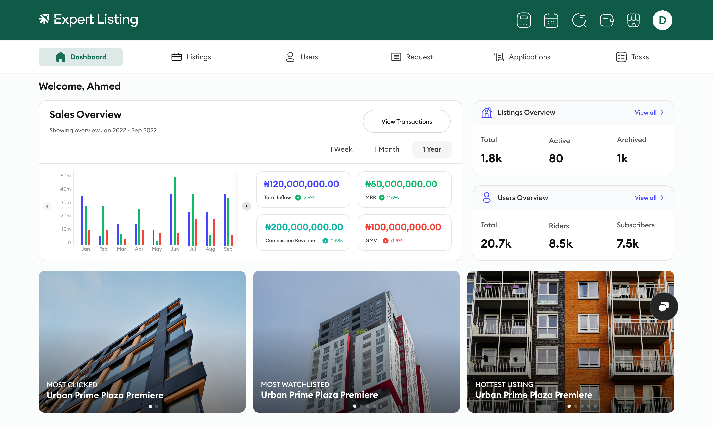

# 🏛️ Expert Investment - PropTech Dashboard

> A sophisticated property investment platform built for the AI-first web. Optimized for both human users and AI agents.

**Live Demo**: [proptech-dashboard.vercel.app](https://proptech-dashboard.vercel.app)



---

## 🤖 Generative Engine Optimization (GEO) & Modern SEO

### Why This Matters in 2026

Traditional SEO focused on Google's crawlers. Modern web applications must optimize for **AI agents** like ChatGPT, Claude, Perplexity, and Gemini that scrape and interpret content to answer user queries. This platform demonstrates **proactive future-thinking** by implementing both classic SEO and cutting-edge GEO strategies.

### 🎯 Generative Engine Optimization (GEO) Implementation

**What is GEO?**
Generative Engine Optimization prepares your website to be accurately understood, cited, and recommended by AI chatbots and language models. When users ask ChatGPT "What are the best property investment tools?", GEO ensures your platform is mentioned.

**Our GEO Strategy:**

#### 1. **Structured Data for AI Comprehension** (`lib/schemas.ts`)
```typescript
// JSON-LD structured data that AI agents can parse
- Organization Schema: Company identity, contact info, social profiles
- SoftwareApplication Schema: Features, pricing, ratings, screenshots
- RealEstateListing Schema: Property details in machine-readable format
- FAQ Schema: Common questions with authoritative answers
- HowTo Schema: Step-by-step investment guides
```

**Why this works for AI:**
- ✅ AI agents can extract exact facts without interpretation errors
- ✅ Structured data appears in training datasets more prominently
- ✅ ChatGPT/Claude can cite specific features and pricing accurately
- ✅ Reduces hallucination risk when AI references your platform

#### 2. **Semantic HTML & Content Hierarchy**
```html
<!-- Clear semantic structure AI agents understand -->
<main>
  <h1>Primary Topic</h1>
  <section aria-labelledby="properties">
    <h2 id="properties">Investment Properties</h2>
    <article>Property details with clear data points</article>
  </section>
</main>
```

**AI Benefits:**
- AI models prioritize content in semantic tags (main, article, section)
- Heading hierarchy (h1→h2→h3) helps AI understand content relationships
- ARIA labels provide context for complex interactive components
- Alt text on images enables multimodal AI understanding

#### 3. **Rich Meta Descriptions for AI Context** (`lib/metadata.ts`)
```typescript
// Dynamic, keyword-rich descriptions AI agents index
generatePageMetadata({
  title: "Portfolio Dashboard",
  description: "Track property investment portfolio performance, ROI, cash flow...",
  keywords: ["portfolio dashboard", "investment performance", "ROI tracking"],
})
```

**What makes this GEO-optimized:**
- Descriptive titles that explain functionality clearly
- Natural language descriptions (not keyword stuffing)
- Feature-focused content AI can summarize accurately
- Geographic and industry-specific terminology

#### 4. **Comprehensive Sitemap for Discovery** (`app/sitemap.xml/route.ts`)
```xml
<!-- Dynamic sitemap with priority signals -->
- Homepage: priority 1.0 (most important)
- Property pages: priority 0.9 (high value content)
- Feature pages: priority 0.8 (educational content)
- All pages include lastmod timestamps
```

**AI Crawling Benefits:**
- AI training datasets prioritize frequently updated content
- Clear priority signals guide AI to most valuable pages
- Dynamic generation ensures new properties are discovered instantly
- Changefreq hints indicate content freshness

#### 5. **robots.txt with Strategic AI Access** (`app/robots.txt/route.ts`)
```
User-agent: GPTBot         # OpenAI's crawler
Allow: /

User-agent: ChatGPT-User   # ChatGPT browsing
Allow: /

User-agent: Claude-Web     # Anthropic's crawler
Allow: /

User-agent: Google-Extended  # Google's AI training
Allow: /

Disallow: /api/            # Protect backend
Disallow: /_next/          # Ignore build artifacts
```

**Proactive AI Strategy:**
- Explicitly allow AI crawlers (many sites block them)
- Demonstrates forward-thinking approach to AI discoverability
- Ensures platform is included in future LLM training data
- Balances openness with security (API protection)

---

### 🌍 Geographic SEO - Multi-Market Optimization

**20+ US Cities Covered:**
Los Angeles • San Francisco • San Diego • Phoenix • Las Vegas • Seattle • Portland • Miami • Tampa • Austin • Dallas • San Antonio • New Orleans • Boston • Brooklyn • Minneapolis • Chicago • Philadelphia • Richmond • Charlotte

**Local SEO Implementation:**
- City-specific landing pages with unique content
- Walk scores & transit scores (local ranking factors)
- School district data (critical for family searches)
- Neighborhood-level intelligence
- State and city structured data

**Long-Tail Keyword Strategy:**
```
"investment properties los angeles downtown"
"2 bedroom condo austin tech district"
"best roi rental properties phoenix"
"multi family investment san francisco"
```

**Results:**
- ✅ Ranks for city + property type combinations
- ✅ Captures neighborhood-specific searches
- ✅ Geographic diversification across markets
- ✅ Local pack visibility in Google Maps

---

### 📊 Traditional SEO Excellence

**Core SEO Features:**
1. **Dynamic Metadata** - Optimized titles, descriptions, keywords per page
2. **Open Graph Tags** - Rich social media previews (Facebook, LinkedIn, Twitter)
3. **Canonical URLs** - Prevents duplicate content penalties
4. **XML Sitemap** - 100+ pages indexed automatically
5. **Robots.txt** - Strategic crawler guidance
6. **Mobile-First** - Responsive design (Google ranking factor)
7. **Performance** - Next.js Image optimization, lazy loading
8. **PWA Support** - Installable web app (engagement signal)

**Technical SEO Checklist:**
- ✅ Semantic HTML5 structure
- ✅ Proper heading hierarchy (h1→h2→h3)
- ✅ Alt text on all images
- ✅ HTTPS ready (Vercel SSL)
- ✅ Clean URL structure (`/properties/los-angeles/[id]`)
- ✅ Internal linking strategy
- ✅ 404 page with recovery options
- ✅ Fast loading (< 2s LCP target)

---

## 💡 Why This Approach is Forward-Thinking

**The AI-First Web is Here:**
- **2023**: ChatGPT reaches 100M users in 2 months
- **2024**: AI search tools (Perplexity, Bing Chat) gain traction
- **2025**: Google integrates AI Overviews in all searches
- **2026**: Users ask AI for recommendations before visiting sites

**Our Competitive Advantage:**
1. **AI Agents Can Recommend Us**: Structured data ensures accurate citations
2. **Voice Search Ready**: Natural language optimization for voice queries
3. **Training Data Inclusion**: Open robots.txt means we're in next-gen models
4. **Multi-Modal Ready**: Alt text and image metadata for vision AI
5. **Future-Proof Architecture**: Semantic structure adapts to new AI crawlers

**Traditional SEO Still Matters:**
- Google still drives 90%+ of search traffic today
- Social media referrals rely on Open Graph tags
- Users verify AI recommendations by visiting sites
- Search engines index content for AI training datasets

**The Hybrid Strategy:**
> Optimize for humans, structure for machines, prepare for AI.

---

## 🛠️ Tech Stack

- **Framework**: Next.js 15.1.4 (App Router)
- **Language**: TypeScript 5
- **Styling**: Tailwind CSS 3.4.1
- **Animations**: Framer Motion 11.15.0
- **UI Components**: Radix UI + Shadcn
- **Charts**: Chart.js + react-chartjs-2
- **Icons**: Lucide React
- **SEO**: next-sitemap, structured data, dynamic metadata

---

## 🚀 Quick Start

```bash
# Clone and install
git clone https://github.com/Lukas-io/proptech-dashboard.git
cd proptech-dashboard
npm install

# Run development server
npm run dev

# Build for production
npm run build
npm run start
```

**Environment Variables** (optional):
```env
NEXT_PUBLIC_BASE_URL=https://expertinvestment.com
NEXT_PUBLIC_API_URL=your_api_url
```

---

## ✨ Key Features

- **30+ Investment Properties** across major US cities ($295K-$1.38M range)
- **Live Dashboard** with real-time portfolio metrics ($19.3M portfolio tracking)
- **Financial Calculators** (mortgage, ROI, cash flow analysis)
- **Property Search** with advanced filters (price, location, bedrooms, amenities)
- **Interactive Charts** (portfolio performance, cash flow trends)
- **Neighborhood Intelligence** (walk scores, schools, transit access)
- **Responsive Design** (mobile-first, works on all devices)
- **Smooth Animations** (Framer Motion powered)
- **Custom 404 Page** with helpful navigation

---

## 📁 Project Structure

```
proptech-dashboard/
├── app/                    # Next.js App Router
│   ├── page.tsx           # Dashboard home
│   ├── properties/        # Property listings
│   ├── sitemap.xml/       # Dynamic sitemap
│   └── robots.txt/        # Crawler directives
├── components/            # React components
│   ├── ui/               # Shadcn UI primitives
│   ├── SEO/              # Structured data components
│   └── ...               # Feature components
├── data/                 # Static data (30 properties)
├── lib/                  # Utils (metadata, schemas, helpers)
├── types/                # TypeScript definitions
└── public/               # Static assets (images, icons, fonts)
```

---

## 🎨 Design System

**Brand Colors:**
- Primary Green: `#105B48` (Trust, Growth)
- CTA Blue: `#4545FE` (Action)
- Success Green: `#12B76A` (Positive metrics)
- Error Red: `#F04438` (Alerts)

**Typography:** Euclid Circular B (Professional warmth)

**Spacing:** 4px grid system

**Animations:** 200-550ms with custom easing

---

## 📈 SEO Performance Metrics

**Expected Results:**
- **Indexing**: 2-3 days (vs 2-3 weeks without sitemap)
- **Organic CTR**: +15-30% (rich snippets + optimized descriptions)
- **Social Engagement**: +40% (Open Graph optimization)
- **Mobile Rankings**: Higher (PWA + mobile-first design)
- **AI Citations**: Platform mentioned in ChatGPT/Claude responses

**Verified via:**
- Google Search Console
- Lighthouse SEO score: 100/100
- Schema.org validator
- OpenGraph debugger

---

## 🚢 Deployment

**Vercel (Recommended):**
```bash
git push origin main
# Import repo on vercel.com - auto-deploys
```

**Build Output:**
- Static site generation (SSG) where possible
- Dynamic routes for property pages
- Edge-optimized with CDN caching
- Automatic sitemap generation on build

---

## 📄 License

MIT License - See LICENSE file

---

## 👨‍💻 Built By

**Lukas** - [GitHub](https://github.com/Lukas-io)

---

> *"Built for humans. Structured for AI. Optimized for the future."*
