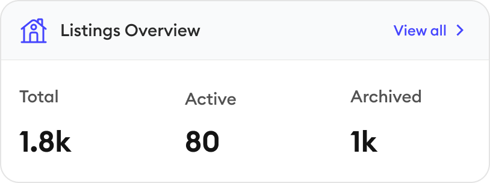
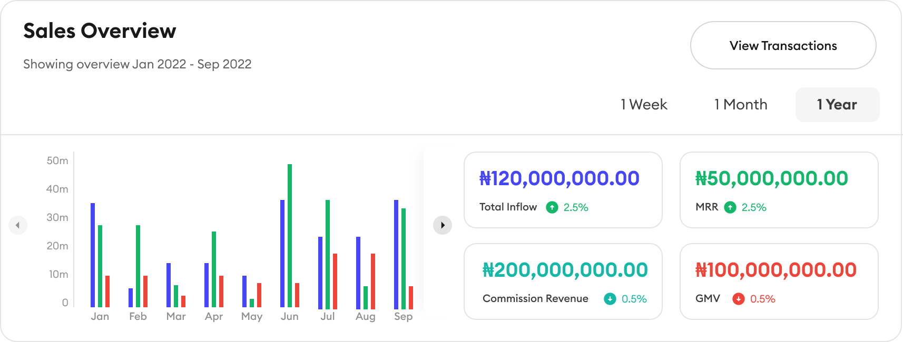
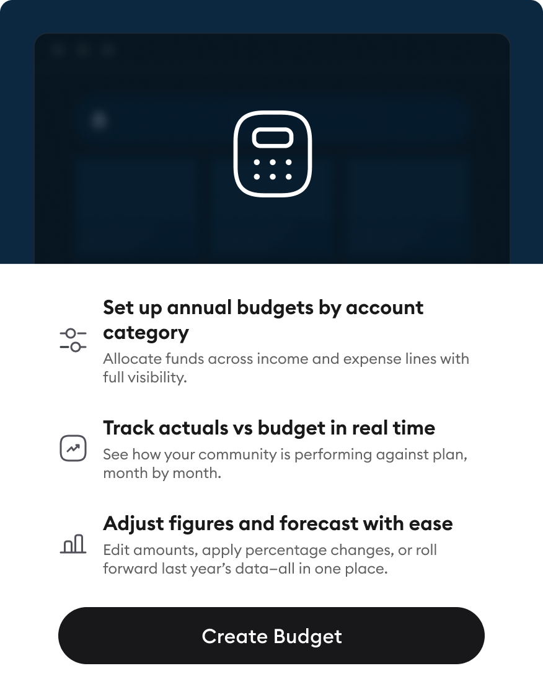
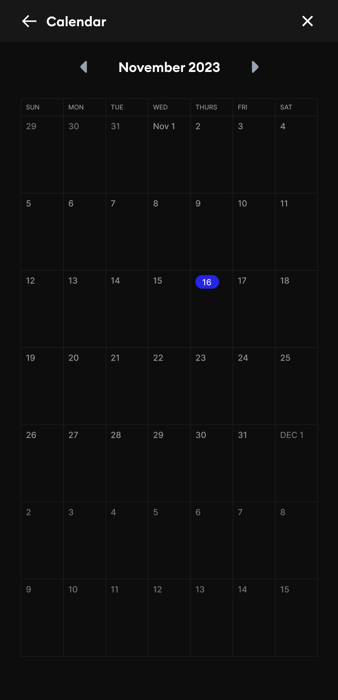

# 🏛️ Expert Investment - PropTech Dashboard

> *"Where data meets design. Where properties become portfolios."*

A sophisticated property investment management platform that transforms real estate data into actionable insights.
Built with Next.js, animated with purpose, and designed for investors.

---

## 🌐 Live Demo

🔗 **[View Live Application](https://proptech-dashboard.vercel.app)** *(will be updated after deployment)*

---

## 📊 Demo Overview


### 🎥 Key Features Showcase

*The application demonstrates:*

- **Live Dashboard** with real-time portfolio metrics and pulsing indicators
- **30+ Diverse Properties** across major US cities ($295K - $1.38M range)
- **Interactive Design States** (success, error, loading, pending, sold, active)
- **Property Search & Filters** with real-time results
- **Advanced Calculators** for mortgage and ROI analysis
- **Property Comparison** side-by-side (up to 3 properties)
- **Responsive Design** optimized for all screen sizes
- **Smooth Animations** powered by Framer Motion

---

<details>
  <summary><h2>📱 ▼ View More Screenshots</h2></summary>
  <br>

<div style="overflow-x: auto; white-space: nowrap; padding-bottom: 10px;">
  
  
  
  
  
</div>

</details>

---

## 📱 Overview

Expert Investment is a comprehensive property investment dashboard that provides real-time portfolio tracking, advanced property search, financial calculators, and interactive data visualization. The platform showcases 30 diverse investment properties across major US cities with complete financial metrics, neighborhood data, and investment analytics.

### Key Features

- **Live Portfolio Dashboard**: Real-time metrics with $19.3M total value tracking and interactive state indicators
- **30 Diverse Properties**: Realistic investment opportunities from Los Angeles to New Orleans ($295K-$1.38M)
- **Advanced Property Search**: Real-time filtering by price, location, bedrooms, amenities, and property type
- **Financial Calculators**:
  - Mortgage calculator with customizable rates and terms
  - ROI calculator with comprehensive rental income analysis
- **Property Comparison**: Side-by-side analysis of up to 3 properties
- **Interactive Design States**: Success, error, loading, pending, sold, and active states showcased throughout
- **Neighborhood Intelligence**: Walk scores, transit scores, school ratings, and nearby amenities
- **Responsive Design**: Seamless experience across desktop, tablet, and mobile

---

## 🛠️ Technical Specifications

### Essential Info

- **Project Name**: PropTech Dashboard
- **Framework**: Next.js 15.1.4 (App Router)
- **Language**: TypeScript 5
- **Styling**: Tailwind CSS 3.4.1
- **Animations**: Framer Motion 11.15.0
- **UI Components**: Radix UI primitives
- **State Management**: React hooks (useState, useMemo, useCallback)

### Core Dependencies

- `next`: ^15.1.4 (React framework with App Router)
- `react`: ^19 (UI library)
- `typescript`: ^5 (Type safety)
- `tailwindcss`: ^3.4.1 (Utility-first CSS)
- `framer-motion`: ^11.15.0 (Animation library)
- `@radix-ui/react-*`: UI primitives (dialog, select, slider, etc.)
- `lucide-react`: ^0.468.0 (Icon library)
- `sonner`: ^1.7.3 (Toast notifications)
- `class-variance-authority`: ^0.7.1 (Component variants)
- `clsx` + `tailwind-merge`: Utility functions

### Development Tools

- `eslint`: ^9 (Code linting)
- `prettier`: Code formatting
- `@types/*`: TypeScript definitions

---

## 🚀 Setup Instructions

### Prerequisites

- Node.js 18.x or higher
- npm, yarn, or pnpm package manager
- Git

### Installation Steps

1. Clone the repository:
   ```bash
   git clone https://github.com/Lukas-io/proptech-dashboard.git
   cd proptech-dashboard
   ```

2. Install dependencies:
   ```bash
   npm install
   # or
   yarn install
   # or
   pnpm install
   ```

3. Set up environment variables (optional):
   ```bash
   cp .env.example .env.local
   ```

### How to Run

1. **Development Mode**:
   ```bash
   npm run dev
   # or
   yarn dev
   # or
   pnpm dev
   ```
   Open [http://localhost:3000](http://localhost:3000) in your browser.

2. **Production Build**:
   ```bash
   npm run build
   npm run start
   ```

3. **Linting**:
   ```bash
   npm run lint
   ```

---

## 🏗️ Implementation Notes

### Key Architectural Decisions

- **Next.js App Router**: Modern file-based routing with React Server Components where appropriate
- **Client Components for Interactivity**: Strategic use of 'use client' for stateful components
- **Type-Safe Data Models**: Comprehensive TypeScript interfaces for all property data
- **Component Composition**: Reusable UI primitives with Radix UI
- **Responsive-First Design**: Mobile-first approach with Tailwind breakpoints
- **Performance Optimization**: Image optimization with Next.js Image component, lazy loading

### Folder Structure

```
proptech-dashboard/
├── app/                    # Next.js App Router pages
│   ├── page.tsx           # Dashboard home (enhanced with live data)
│   ├── layout.tsx         # Root layout with navigation
│   ├── properties/        # Property listings
│   ├── investors/         # Investor management
│   ├── opportunities/     # Investment opportunities
│   ├── proposals/         # Proposal tracking
│   ├── tasks/            # Task management
│   └── guides/           # User guides
├── components/            # React components
│   ├── ui/               # Shadcn UI components (button, card, input, etc.)
│   ├── PropertyCard.tsx  # Enhanced property display with animations
│   ├── Navigation.tsx    # Main navigation
│   ├── Footer.tsx        # Site footer (planned)
│   └── ...              # Feature-specific components
├── data/                 # Static data
│   └── properties.ts     # 30 realistic property listings
├── types/                # TypeScript definitions
│   ├── property.ts       # Property data model
│   └── index.ts         # Type exports
├── lib/                  # Utility functions
│   ├── utils.ts         # Tailwind class merging
│   └── metadata.ts      # SEO metadata helpers
├── hooks/                # Custom React hooks (planned)
├── public/               # Static assets
│   ├── images/          # Property images
│   ├── icons/           # Icon assets
│   └── favicon.svg      # Site favicon
└── designs/              # Design references
    └── components/       # Component mockups
```

### Notable Features

1. **Comprehensive Property Data**: Each property includes:
   - Financial metrics (purchase price, current value, ROI, cash flow, cap rate)
   - Location details (address, city, walk/transit scores, nearby places)
   - Property specs (beds, baths, sqft, property type)
   - Neighborhood data (schools with ratings, amenities)
   - Agent information
   - Multiple property images

2. **Live Dashboard Showcase**:
   - Pulsing "Live" indicator for real-time feel
   - Calculated portfolio metrics ($19.3M value, $122.4K monthly income)
   - Interactive state cards (success, error, warning)
   - Recent activity feed with timestamps
   - Tab navigation (Active, Pending, Sold)
   - Loading state toggle for demonstration

3. **Enhanced Property Cards**:
   - Animated image carousel with auto-advance
   - ROI, cash flow, and appreciation badges
   - Hover effects with scale and shadow transitions
   - Favorite/wishlist functionality
   - Status overlays (Sold, Under Contract)
   - Responsive property details (price, beds, baths, sqft)

4. **Design System**:
   - Primary Green: `#105B48`
   - CTA Blue: `#4545FE`
   - Success Green: `#12B76A`
   - Error Red: `#F04438`
   - Border Radius: 10px (0.625rem)
   - Animation Duration: 200-550ms
   - Consistent spacing on 4px grid

### Challenges & Solutions

1. **Data Model Extension**: Extended property interface to include amenities, neighborhood intelligence, agent details, and featured/new flags
2. **State Management**: Used React's built-in hooks (useState, useMemo) for efficient state updates and derived data
3. **Animation Performance**: Leveraged Framer Motion's whileHover and AnimatePresence for smooth, hardware-accelerated animations
4. **Responsive Design**: Mobile-first approach with Tailwind breakpoints (sm, md, lg, xl)
5. **Type Safety**: Comprehensive TypeScript interfaces prevent runtime errors and improve DX

### Current Implementation Status

✅ **Completed** (Tasks 1-2 of 13):
- Property data model with 30 diverse properties
- Enhanced dashboard with live indicators and design states
- Interactive metrics cards
- Activity feed
- Tab navigation (Active/Pending/Sold)
- Loading state demonstration
- Enhanced PropertyCard component

🔄 **In Progress**:
- Property search and filters
- Mortgage calculator
- ROI calculator
- Property comparison
- Contact forms
- Map integration
- Footer and trust signals

### Known Limitations

- Property data is static (no backend integration yet)
- Authentication is placeholder
- Some calculator features are planned
- Map integration uses placeholder
- Limited to 30 property listings

---

## 🧪 Testing Approach

### Manual Testing Checklist

- ✅ Dashboard loads with correct portfolio metrics
- ✅ Property cards display with proper animations
- ✅ Tab navigation switches between Active/Pending/Sold
- ✅ Loading state toggle demonstrates skeleton loading
- ✅ Responsive design works on mobile, tablet, desktop
- ✅ Property card hover effects work smoothly
- ✅ Wishlist functionality toggles correctly
- ✅ Live indicators animate properly

### Browser Compatibility

Tested on:
- Chrome 120+
- Safari 17+
- Firefox 121+
- Edge 120+

### Responsive Breakpoints

- Mobile: 320px - 640px
- Tablet: 641px - 1024px
- Desktop: 1025px - 1440px
- Large: 1441px+

---

## ⚡ Performance Optimizations

1. **Next.js Image Optimization**: Automatic image optimization with proper sizing
2. **Lazy Loading**: Images load on-demand below the fold
3. **Component Memoization**: useMemo for expensive calculations
4. **Efficient Re-renders**: Strategic use of useState and useCallback
5. **CSS-in-JS Optimization**: Tailwind CSS for zero-runtime styling
6. **Animation Performance**: GPU-accelerated transforms (translate, scale)
7. **Code Splitting**: Automatic code splitting via Next.js App Router

---

## 🎨 Design Philosophy

The application emphasizes:

- **Clarity**: Clean data visualization with clear hierarchy
- **Trust**: Professional color palette and consistent branding
- **Responsiveness**: Fluid animations and instant feedback
- **Intelligence**: Data-driven insights and smart calculations
- **Accessibility**: Semantic HTML and ARIA labels
- **Typography**: "Euclid Circular B" for professional warmth

Design Principles:
- **Brand Consistency**: Primary green (#105B48) throughout
- **Information Density**: Balanced content without overwhelming
- **Visual Hierarchy**: Clear distinction between primary and secondary actions
- **State Communication**: Explicit visual feedback for all states
- **Motion Purpose**: Animations guide attention and provide feedback

---

## 🚀 Deployment

### Vercel Deployment (Recommended)

1. Push to GitHub:
   ```bash
   git add .
   git commit -m "feat: comprehensive PropTech dashboard with 30 properties"
   git push origin main
   ```

2. Deploy to Vercel:
   - Visit [vercel.com](https://vercel.com)
   - Import your GitHub repository
   - Vercel will auto-detect Next.js and configure build settings
   - Click "Deploy"

### Manual Deployment

```bash
# Build for production
npm run build

# Test production build locally
npm run start

# Deploy to your hosting provider
# (follow provider-specific instructions)
```

### Environment Variables

No environment variables required for basic functionality. Add `.env.local` for future API integrations:

```env
NEXT_PUBLIC_API_URL=your_api_url_here
NEXT_PUBLIC_GOOGLE_MAPS_KEY=your_maps_key_here
```

---

## 📈 Future Enhancements

Planned features:
- [ ] Complete property search with advanced filters
- [ ] Mortgage and ROI calculators with detailed breakdowns
- [ ] Property comparison table
- [ ] Interactive map view with property markers
- [ ] Contact forms with validation
- [ ] User authentication and saved favorites
- [ ] Backend API integration
- [ ] Real-time market data integration
- [ ] Investment portfolio analytics
- [ ] Document upload and management
- [ ] Email notifications
- [ ] Dark mode support

---

## 📄 License

This project is licensed under the MIT License - see the LICENSE file for details.

---

## 👨‍💻 Developer

Built by **Lukas** - [GitHub](https://github.com/Lukas-io)

---

> *"Invest smart. Analyze deep. Build wealth."*

---

## 🙏 Acknowledgments

- Design inspiration from modern PropTech platforms
- Property data structure based on real estate industry standards
- UI components built with Radix UI primitives
- Icons by Lucide React
- Animations powered by Framer Motion
